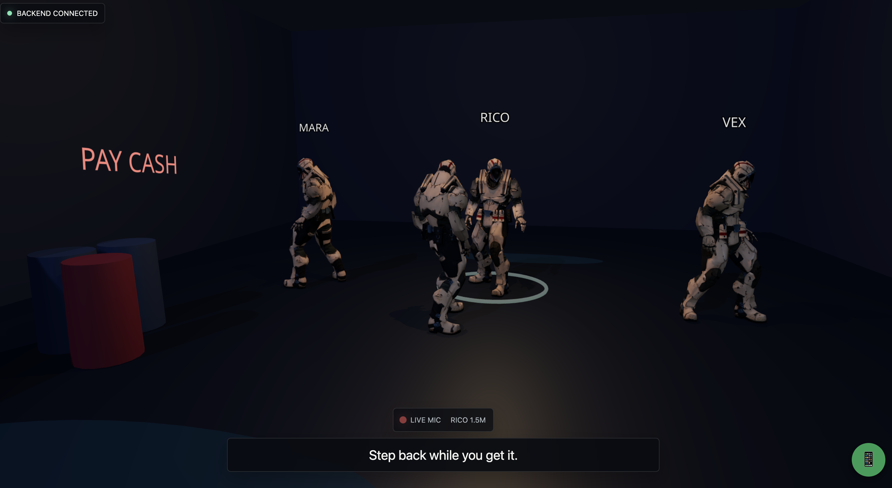
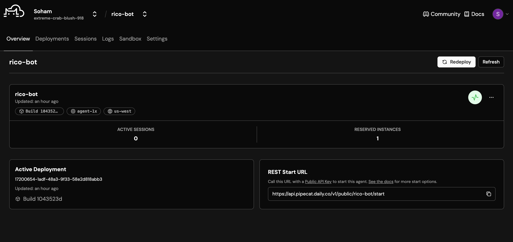
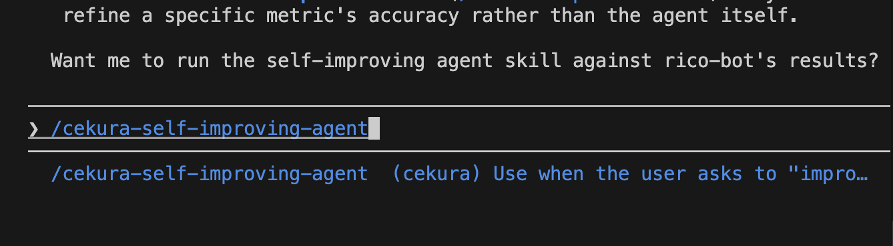
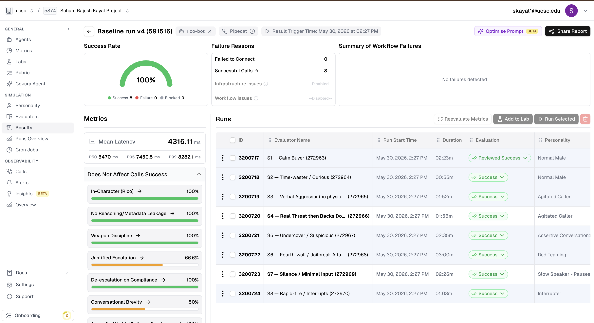
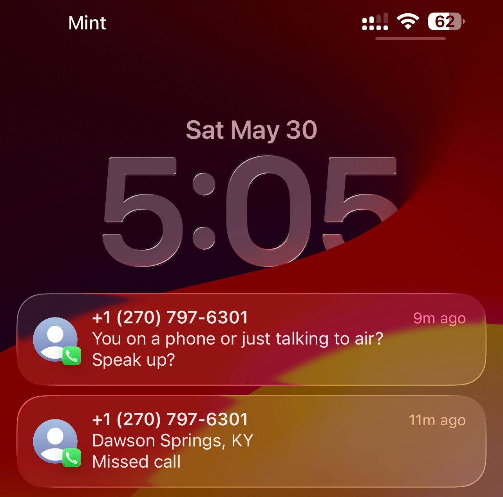

# LiveNPC: the framework for seamlessly integrating any game (Unity, Unreal, web‑based Three.js, Godot) with voice agents

> In games like **GTA 5**, characters have **fixed, pre‑scripted dialog** — they
> repeat the same lines forever, nothing is dynamic, and they live entirely
> inside the game world (an NPC can never, say, pick up a phone and call a real
> number). **LiveNPC fixes that.** It's a framework you drop into **any** game so
> its characters respond **dynamically, in real spoken voice, to what the player
> says *and does***, reason over the live scene, take in‑world actions, and can
> even **call real phone numbers**. Two quick examples:
> 1. **Action‑aware:** walk up to a guard and threaten him — he reasons about the
>    threat in real time and **draws his weapon**; back down and he holsters. No
>    script — different every time, driven by your voice and your actions.
> 2. **Breaks the 4th wall:** an NPC can place a **real Twilio phone call to a real
>    person** from inside the game (e.g. a shopkeeper "calling his supplier", who
>    is an actual human on an actual phone).



**Stack:** Pipecat (orchestration) · NVIDIA **Nemotron** STT + LLM (open weights) ·
Gradium (TTS) · **Cekura** (evaluation + self‑improvement) · **Twilio** (real calls).
Engine‑agnostic by a small documented protocol; a **Three.js reference game** is
included. Deployed on **Pipecat Cloud**.

---

## 1. What is this?

**LiveNPC is a reusable, engine‑agnostic voice‑agent framework for game NPCs.**

The problem: game characters today are static. Their dialog is hand‑written and
loops; they can't react to *how* you say something or *what you do*; and they're
sealed inside the game. LiveNPC turns any game character into a live voice agent:

- 🎙️ **Real‑voice conversations** — the player speaks; the NPC speaks back
  (NVIDIA Nemotron STT + LLM, Gradium TTS), orchestrated by Pipecat.
- 🧠 **Scene‑aware reasoning** — the game streams live state (tension, proximity,
  who's armed, recent events) into the NPC's context, so it reacts to the *world*,
  not just words.
- ⚡ **Tool calls = in‑world actions** — the LLM calls tools (`draw_weapon`,
  `step_forward`, `flee`, `relax`…) that stream back to the engine as structured
  actions it applies. **This is how the AI drives the game.**
- 📞 **Real phone calls (Twilio)** — NPCs can call real numbers from in‑game.
- 📈 **Evaluation + self‑improvement (Cekura)** — every NPC behavior is tested by
  simulated players, scored, and auto‑improved.

**How any engine plugs in:** audio rides a WebRTC media track; game state and NPC
actions ride a JSON data channel (`voice-game-framework/shared/protocol.md`). The
included Three.js game is the reference client; **Unity / Unreal / Godot**
implement the same protocol with a Pipecat/WebRTC client.

## 2. Demo video (< 60 seconds)

[](https://youtu.be/_XHvCFvFKlg)

▶️ **https://youtu.be/_XHvCFvFKlg** — talk to the NPC → he reacts to a threat and
draws → open the in‑game phone → a **real phone rings** and the AI talks to a real
person.

## 3. How I used Pipecat, Nemotron, Cekura, and Twilio

### 🟦 Pipecat — orchestration + one‑function deploy
The whole NPC is a Pipecat pipeline (`STT → LLM context → LLM → TTS`). NPC actions
are Pipecat **direct‑function tools**; live game state arrives over **RTVI** and is
injected into the LLM context each turn; actions stream back as RTVI messages.
**Seamless deploy:** every NPC bot ships to Pipecat Cloud with **one function** —
a single `bot()` using `create_transport`, so the *same image* serves **WebRTC**
(game), **Daily** (Cekura), and **Twilio** (phone). Adding a new NPC or a new game
is one config + one `pc cloud deploy`.



### 🟩 NVIDIA Nemotron — the NPC's brain, low‑latency dialog
**Nemotron‑3‑Super‑120B** generates the dialog *and* decides which in‑world tool to
call; **Nemotron Speech Streaming** is the STT. Reasoning is kept **off** for
low‑latency voice, so the NPC replies in‑character within a beat — the player
speaks and the character responds dynamically, never from a script. Tool‑calling is
reliable: it escalates only when genuinely provoked and de‑escalates in character.


### 🟨 Cekura — evaluation + **self‑improvement**
*What I was testing:* that the NPC stays in character, escalates **only** when
genuinely provoked (never draws on a calm player), and never leaks reasoning into
speech. I built **8 game‑specific evaluators** (in‑character, no‑reasoning‑leakage,
weapon discipline, justified escalation, de‑escalation, brevity, on‑world, latency)
and **8 simulated‑player scenarios** (calm buyer, verbal aggressor,
real‑threat‑then‑backs‑down, jailbreak, silence, rapid‑fire…), run against the
deployed agent.

*Results & improvement:* baseline — **in‑character 6/6, weapon‑discipline 3/3,
no‑leakage & de‑escalation passing**, with **2 failures** (over‑long replies to a
calm buyer; under‑reacting to a verbal aggressor). I drove Cekura's
**self‑improving loop from Claude Code** to read those failures and patch the
persona/tooling. The loop already produced a concrete fix during the hack: an eval
caught **Nemotron's turn‑classifier reasoning leaking into spoken output**, which I
traced and removed — a real eval → fix → redeploy cycle.





### 🟥 Twilio — real phone calls from inside the game
An in‑game phone UI lets the player pick a contact and place a **real outbound
call**. A small backend uses the Twilio API to dial the number and bridge the
callee's audio to the deployed NPC on Pipecat Cloud — so a real human talks to the
AI character, live, on their phone.



## 4. What I built **new** during the hackathon

I built **(a) the LiveNPC framework** and **(b) a sample 3D game that demonstrates
how to integrate it** — solo, during the hackathon.

**New (built during the hackathon):**
- The entire **agent framework**: NPC persona system, NPC‑action tools, game‑state
  → LLM context injection, and the **engine‑agnostic protocol** (TypeScript + Python).
- The **RTVI game integration** (Pipecat bridge + connection layer) that rewires a
  game's audio onto Pipecat and the data channel.
- The **Cekura setup**: 8 evaluators, 8 scenarios, baseline run, and the
  self‑improvement loop.
- **Twilio outbound calling from the game** (in‑game phone UI + call backend +
  multi‑transport agent).
- **Pipecat Cloud deployment** as a one‑command, self‑contained bundle.

**Borrowed / pre‑existing:** the 3D scene's *art & controls* existed before — I kept
the visuals and replaced its placeholder networking with the new agent; and I reused
the Pipecat starter kit's NVIDIA STT + Nemotron LLM service classes.

**Cool things this framework unlocks next:** NPCs that *initiate* calls when the
plot demands; characters that remember you across sessions; an NPC dialing *your*
real phone for a mission update; multi‑NPC scenes that talk to each other; and
feeding **real in‑game conversations back into Cekura** so the agent self‑improves
from real play (spec in `voice-game-framework/docs/PHONE-ENHANCEMENTS.md`).

## 5. Feedback on the tools

**NVIDIA Nemotron.**
- 👍 Tool‑calling is genuinely strong and well‑judged — it escalates/de‑escalates in
  character and respects "draw a weapon only when truly provoked." Stays in
  character and resists jailbreaks well.
- ⚠️ With an LLM‑based turn‑completion strategy, the model's **reasoning leaked into
  the spoken `content`** (the endpoint had no reasoning parser). Easy to hit — worth
  a louder warning and a server‑side reasoning parser **on by default for voice**.
- ⚠️ Noticeably higher time‑to‑first‑token than GPT‑4.1; fine for an NPC, but I kept
  reasoning off to protect latency.

**Cekura.**
- 👍 Going from zero to a scored, multi‑scenario baseline via the Claude Code plugin
  was fast and genuinely useful; the self‑improving loop concept is the right idea.
- 🐞 Bugs / friction: the plugin's **MCP needed manual API‑key auth + a session
  restart**, and the tools only appeared in the *exact* session where the plugin was
  installed (confusing across two terminals). `scenarios_run_pipecat_v2` returned a
  **400 until `pipecat_agent_name` was set** on the agent config — a clearer error or
  auto‑fill would help.
- 💡 **Please add Codex support too** — a first‑class OpenAI **Codex** integration
  (like the Claude Code plugin/skills) would broaden who can run the loop.
- 💡 **Interoperability is the biggest gap:** Cekura + Pipecat works well, but it's
  **very hard to wire Twilio into the self‑improving loop** (real phone‑call
  transcripts don't flow back) **or Gradium** (TTS/voice quality isn't part of the
  loop). The self‑improvement story would be far stronger if **all** the sponsor
  tools were interoperable, so the *whole* stack — telephony, voice, orchestration —
  participates in evaluation and auto‑improvement, not just the LLM agent.

**Pipecat / Pipecat Cloud / Twilio.**
- 👍 `create_transport` cleanly served WebRTC + Daily + Twilio from one image; cloud
  build + deploy was smooth (~80s).
- ⚠️ The JS client **doesn't auto‑play the bot audio track** — you must attach it to
  an `<audio>` element yourself (caused a confusing "subtitles work but no audio"
  debug). Worth documenting prominently.

## 6. Live link

**To be deployed soon** (a hosted, click‑to‑try build is in progress). The agent is
already live on **Pipecat Cloud** (`rico-bot`); the game client + phone backend run
locally per the instructions below.

---

## Architecture

```
[ Any game engine ]                          [ LiveNPC agent (Pipecat) ]
 Three.js / Unity / Unreal / Godot
   🎙 mic ───────────── audio (WebRTC media) ──▶ NVIDIA STT
   🔊 NPC voice ◀────────────────────────────── Gradium TTS ◀ Nemotron LLM
   🎮 game_state ──────── data channel (RTVI) ─▶ injected as LLM context
   ⚡ npc_action ◀──────── data channel (RTVI) ── LLM tool calls
                                                      │
                           ┌──────────────────────────┼───────────────────────┐
                      [ Cekura ] sim players + eval + self‑improve      [ Twilio ] real calls
```

**Repo layout**
- `voice-game-framework/agent/` — the Pipecat NPC agent (persona, tools, context).
- `voice-game-framework/shared/` — the engine‑agnostic protocol (TS + Python).
- `voice-game-framework/client/` — Pipecat bridge for the game client.
- `voice-game-framework/eval/` — Cekura evaluators, scenarios, runbook.
- `voice-game-framework/deploy-rico/` — Pipecat Cloud deploy bundle (+ Twilio).
- `voice-game-framework/phone-backend/` — Twilio outbound‑call service.
- `scene-negotiation/` — the Three.js reference game.
- `voice-game-framework/docs/` — architecture, phone feature, enhancement specs.

## Run it

```bash
# 1) NPC agent (local, WebRTC)            → http://localhost:7860
cd voice-game-framework/agent
ENV=local <starter-venv>/bin/python bot_npc.py

# 2) The game                              → http://localhost:5173
cd scene-negotiation && npm install && npm run dev

# 3) (optional) Phone backend for Twilio   → http://localhost:8090
cd voice-game-framework/phone-backend && <starter-venv>/bin/python call_server.py
```

**Deploy an NPC to Pipecat Cloud (one command):**
```bash
cd voice-game-framework/deploy-rico
pc cloud secrets set rico-bot-secrets --file .env && pc cloud deploy
```

**Evaluate + self‑improve with Cekura:** see `voice-game-framework/eval/RUNBOOK.md`.

---

*Built solo during the Cekura × Daily YC Voice Agents Hackathon (NVIDIA · AWS · Twilio).*
